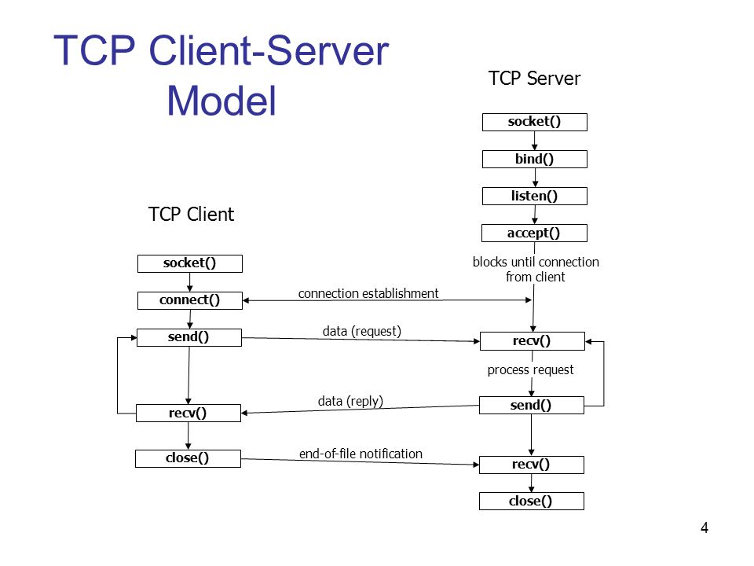

# Programowanie sieciowe w C

Gniazda (sockets) są podstawowym interfejsem systemowym do komunikacji sieciowej. W systemach POSIX korzystamy z nich przez funkcje takie jak `socket()`, `bind()`, `listen()`, `accept()`, `connect()`, `send()` i `recv()`.

## Cele

Po tej prezentacji powinieneś umieć:

- odróżnić TCP od UDP,
- opisać cykl życia gniazda klienta i serwera,
- wyjaśnić rolę adresu IP i portu,
- rozumieć, że TCP jest strumieniem bajtów bez granic wiadomości,
- poprawnie interpretować wyniki `send()` i `recv()`.

## Model klient-serwer



W najprostszym modelu:

1. serwer wiąże gniazdo z adresem i portem,
2. serwer czeka na klientów,
3. klient łączy się z adresem serwera,
4. obie strony wymieniają dane,
5. po zakończeniu zamykają gniazda.

## TCP a UDP

| Cecha | TCP | UDP |
| --- | --- | --- |
| Model | połączeniowy | datagramowy |
| Kolejność danych | zachowana | brak gwarancji |
| Dostarczenie | retransmisja i kontrola po stronie protokołu | brak gwarancji |
| Granice wiadomości | nie — strumień bajtów | tak — datagramy |
| Typ gniazda | `SOCK_STREAM` | `SOCK_DGRAM` |
| Typowe użycie | HTTP, SSH, bazy danych | DNS, telemetry, multimedia, gry |

UDP nie jest po prostu „szybszym TCP”. Ma inne własności i mniejszy narzut protokołu, ale aplikacja sama musi zdecydować, co zrobić z utratą, duplikacją lub zmianą kolejności datagramów.

## Adres IP i port

Adres IP identyfikuje interfejs hosta w sieci. Port identyfikuje punkt końcowy używany przez proces.

Dla IPv4 często spotkamy `struct sockaddr_in`, a dla IPv6 `struct sockaddr_in6`. W kodzie przenośnym warto korzystać z `getaddrinfo()`, który ukrywa wiele szczegółów adresowania.

## Cykl życia serwera TCP

```text
socket()
   |
bind()
   |
listen()
   |
accept()
   |
recv() / send()
   |
close()
```

`accept()` zwraca **nowy deskryptor** dla konkretnego klienta. Gniazdo nasłuchujące pozostaje dostępne do przyjmowania kolejnych połączeń.

## Cykl życia klienta TCP

```text
socket()
   |
connect()
   |
send() / recv()
   |
close()
```

## Tworzenie gniazda

```c
#include <sys/socket.h>

int fd = socket(AF_INET, SOCK_STREAM, 0);
if (fd < 0) {
    perror("socket");
}
```

- `AF_INET` — IPv4,
- `AF_INET6` — IPv6,
- `SOCK_STREAM` — strumień, zwykle TCP,
- `SOCK_DGRAM` — datagramy, zwykle UDP.

## Kolejność bajtów

Porty i część pól protokołów są zapisywane w sieciowej kolejności bajtów.

```c
uint16_t port = htons(8080);
```

Przydatne funkcje:

- `htons()` / `ntohs()` — 16 bitów,
- `htonl()` / `ntohl()` — 32 bity.

## Serwer i `INADDR_ANY`

Dla serwera IPv4 można związać gniazdo ze wszystkimi lokalnymi interfejsami:

```c
struct sockaddr_in addr = {0};

addr.sin_family = AF_INET;
addr.sin_port = htons(8080);
addr.sin_addr.s_addr = htonl(INADDR_ANY);
```

`INADDR_ANY` służy do **lokalnego bindu serwera**. Nie jest adresem zdalnego serwera, z którym klient powinien się łączyć.

## Minimalny szkielet serwera TCP

```c
#include <arpa/inet.h>
#include <stdio.h>
#include <stdlib.h>
#include <string.h>
#include <sys/socket.h>
#include <unistd.h>

int main(void) {
    int server_fd = socket(AF_INET, SOCK_STREAM, 0);
    if (server_fd < 0) {
        perror("socket");
        return EXIT_FAILURE;
    }

    int yes = 1;
    setsockopt(server_fd, SOL_SOCKET, SO_REUSEADDR, &yes, sizeof(yes));

    struct sockaddr_in addr = {0};
    addr.sin_family = AF_INET;
    addr.sin_port = htons(8080);
    addr.sin_addr.s_addr = htonl(INADDR_ANY);

    if (bind(server_fd, (struct sockaddr *)&addr, sizeof(addr)) < 0) {
        perror("bind");
        close(server_fd);
        return EXIT_FAILURE;
    }

    if (listen(server_fd, 16) < 0) {
        perror("listen");
        close(server_fd);
        return EXIT_FAILURE;
    }

    int client_fd = accept(server_fd, NULL, NULL);
    if (client_fd < 0) {
        perror("accept");
        close(server_fd);
        return EXIT_FAILURE;
    }

    char buffer[1024];
    ssize_t n = recv(client_fd, buffer, sizeof(buffer), 0);

    if (n > 0) {
        printf("odebrano %zd bajtów\n", n);
    } else if (n == 0) {
        printf("klient zamknął połączenie\n");
    } else {
        perror("recv");
    }

    close(client_fd);
    close(server_fd);
    return EXIT_SUCCESS;
}
```

To przykład dydaktyczny: obsługuje tylko jednego klienta i nie implementuje pełnego protokołu aplikacyjnego.

## TCP nie zachowuje granic wiadomości

Jeżeli klient wykona:

```c
send(fd, "ABC", 3, 0);
send(fd, "DEF", 3, 0);
```

serwer nie ma gwarancji, że zobaczy dwa osobne odczyty po 3 bajty. Może otrzymać np.:

- 6 bajtów naraz,
- 2 bajty, a potem 4,
- albo inny podział strumienia.

Dlatego protokół aplikacyjny musi sam wyznaczać granice wiadomości, np. przez:

- stałą długość,
- separator,
- nagłówek z długością,
- format ramkowany.

## Częściowy zapis i odczyt

`send()` może wysłać mniej bajtów, niż poprosiliśmy. Kod powinien obsłużyć pozostałą część bufora.

`recv()` zwraca:

- `> 0` — liczbę odebranych bajtów,
- `0` — druga strona zakończyła wysyłanie w sposób uporządkowany,
- `-1` — błąd; szczegóły są dostępne przez `errno`.

Nie wolno zakładać, że jedno `send()` odpowiada jednemu `recv()`.

## Rozwiązywanie nazw przez `getaddrinfo()`

Zamiast ręcznie kodować tylko IPv4, można użyć:

```c
#include <netdb.h>

struct addrinfo hints = {0};
hints.ai_family = AF_UNSPEC;
hints.ai_socktype = SOCK_STREAM;

struct addrinfo *result = NULL;
int rc = getaddrinfo("example.com", "80", &hints, &result);
```

`AF_UNSPEC` pozwala otrzymać zarówno adresy IPv4, jak i IPv6.

Po użyciu listy trzeba wykonać:

```c
freeaddrinfo(result);
```

## Serwery współbieżne

Serwer może obsługiwać wielu klientów na różne sposoby:

- proces na klienta,
- wątek na klienta,
- pula wątków,
- pętla zdarzeń z `select()`, `poll()`, `epoll()`, `kqueue()` itp.

Nie ma jednego najlepszego modelu. Wybór zależy od liczby połączeń, kosztu obsługi klienta, platformy i wymagań projektu.

## Najczęstsze pułapki

- Traktowanie TCP jak protokołu wiadomości zamiast strumienia bajtów.
- Ignorowanie częściowych wyników `send()` i `recv()`.
- Brak obsługi błędów i przerwań systemowych.
- Mylenie adresu lokalnego do `bind()` z adresem zdalnym do `connect()`.
- Zakładanie, że struktury adresowe mają identyczny layout na każdej platformie.
- Brak limitów czasu i limitów rozmiaru danych w kodzie produkcyjnym.
- Niezamykanie deskryptorów po błędzie.

## Podsumowanie

Najważniejszy model TCP:

```text
serwer: socket -> bind -> listen -> accept -> recv/send -> close
klient: socket -> connect ----------> send/recv -> close
```

Najważniejsza zasada praktyczna: **TCP dostarcza uporządkowany strumień bajtów, ale granice wiadomości definiuje aplikacja.**
