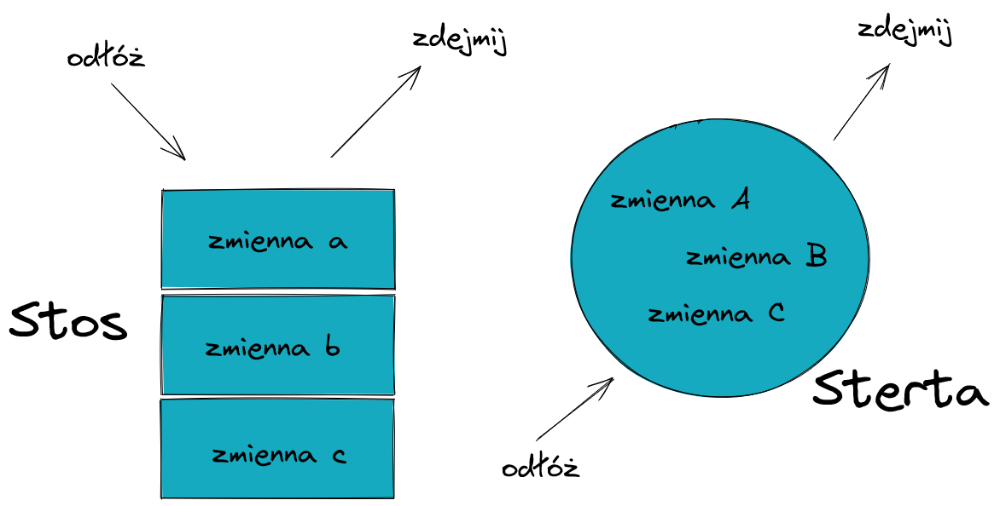

# Stos, sterta i czas życia obiektów

W rozmowach o pamięci często używamy pojęć „stos” i „sterta”. W C i C++ jeszcze ważniejsze jest jednak rozumienie **czasu życia obiektu** oraz tego, kto odpowiada za zwolnienie zasobu.

## Cele

Po tej prezentacji powinieneś umieć:

- odróżnić automatyczny i dynamiczny czas przechowywania,
- wyjaśnić typową rolę stosu i sterty,
- poprawnie parować `malloc/free` oraz `new/delete`,
- rozpoznać dangling pointer i wyciek pamięci,
- wyjaśnić, dlaczego nowoczesny C++ preferuje RAII.

## Typowy układ pamięci procesu


Rzeczywisty układ zależy od systemu, formatu pliku wykonywalnego i mechanizmów ochrony pamięci. Schematy ze „stosem” i „stertą” są użytecznym modelem, ale nie stanowią kompletnego opisu całej pamięci procesu.

## Stos i automatyczny czas przechowywania

Typowa lokalna zmienna ma automatyczny czas przechowywania:

```cpp
void funkcja() {
    int licznik = 0;
}
```

Jej czas życia kończy się przy opuszczeniu zakresu.

W praktycznych implementacjach takie obiekty często znajdują się w ramce stosu, choć standard języka opisuje przede wszystkim czas przechowywania i semantykę, a nie konkretny adres fizyczny.

Stos jest zwykle:

- szybki w tworzeniu i zwalnianiu ramek,
- ograniczony rozmiarem,
- powiązany z wywołaniami funkcji,
- zarządzany automatycznie przez mechanizm wywołań.

## Sterta i dynamiczny czas przechowywania

Pamięć dynamiczna jest przydzielana w czasie działania programu i żyje do chwili jawnego zwolnienia albo przejęcia jej przez obiekt zarządzający zasobem.

W C:

```c
#include <stdlib.h>

size_t n = 100;
int *data = malloc(n * sizeof *data);

if (data == NULL) {
    /* obsługa błędu */
}

/* użycie data */

free(data);
data = NULL;
```

W C nie trzeba rzutować wyniku `malloc()`.

## Zasięg to nie to samo co czas życia

To, że obiekt ma dynamiczny czas życia, nie oznacza, że jest „widoczny wszędzie”.

```cpp
void f() {
    int *p = new int(42);
    // nazwa p jest lokalna dla f
    delete p;
}
```

Dostęp do obiektu zależy od tego, czy kod posiada wskaźnik lub referencję do niego. Zasięg nazwy i miejsce/czas przechowywania to różne pojęcia.

## Nie zwracaj wskaźnika do lokalnego obiektu

Błąd:

```cpp
int* zle() {
    int tablica[10] = {};
    return tablica;
}
```

Po wyjściu z funkcji czas życia tablicy się kończy. Zwrócony wskaźnik staje się **dangling pointer**.

Lepsze rozwiązania w C++:

```cpp
#include <array>

std::array<int, 10> dobrze() {
    return {};
}
```

albo dla rozmiaru znanego dopiero w czasie działania:

```cpp
#include <vector>

std::vector<int> dobrze(std::size_t n) {
    return std::vector<int>(n);
}
```

## `malloc/free` a `new/delete`

| Cecha | `malloc/free` | `new/delete` |
| --- | --- | --- |
| Język | C i dostępne także z C++ | C++ |
| Wynik alokacji | `void*` | wskaźnik odpowiedniego typu |
| Konstruktor | nie | tak |
| Destruktor | nie | tak |
| Błąd alokacji | `NULL` | domyślnie `std::bad_alloc` |
| Rozmiar | podawany w bajtach | wyliczany z typu |

Pary muszą się zgadzać:

```text
malloc  <-> free
calloc  <-> free
realloc <-> free
new     <-> delete
new[]   <-> delete[]
```

Mieszanie tych mechanizmów prowadzi do niezdefiniowanego zachowania.

## `new` zwraca wskaźnik

```cpp
int *p = new int(42);
delete p;
```

Dla tablicy:

```cpp
int *data = new int[100];
delete[] data;
```

Surowe `new` i `delete` są poprawnymi elementami języka, ale w kodzie aplikacyjnym zwykle nie są pierwszym wyborem.

## RAII w nowoczesnym C++

RAII oznacza, że zasób jest własnością obiektu, a jego zwolnienie następuje automatycznie w destruktorze.

Najczęściej lepiej użyć kontenera:

```cpp
std::vector<int> data(100);
```

albo inteligentnego wskaźnika:

```cpp
auto value = std::make_unique<int>(42);
```

Nie trzeba wtedy ręcznie pisać `delete`.

RAII działa także podczas wyjątków i wcześniejszych wyjść z funkcji, co znacząco zmniejsza ryzyko wycieków.

## Stos a sterta — praktyczne porównanie



| Cecha | Typowy stos | Pamięć dynamiczna |
| --- | --- | --- |
| Zarządzanie | automatyczne | allocator / obiekt zarządzający |
| Czas życia | zwykle związany z zakresem | sterowany przez program |
| Koszt przydziału | zwykle bardzo niski | zwykle wyższy |
| Rozmiar | relatywnie ograniczony | zwykle znacznie większy |
| Typowe użycie | lokalne obiekty, ramki wywołań | dane o dynamicznym rozmiarze/czasie życia |

Nie należy jednak zakładać, że „sterta jest zawsze wolna, a stos zawsze szybki” dla każdego dostępu. Różnice dotyczą głównie sposobu alokacji, lokalności danych i modelu zarządzania.

## Najczęstsze błędy pamięci

- wyciek pamięci — utrata ostatniego wskaźnika do zaalokowanego bloku,
- use-after-free — użycie obiektu po zakończeniu jego czasu życia,
- double free / double delete — podwójne zwolnienie,
- dangling pointer — wskaźnik do obiektu, który już nie istnieje,
- stack overflow — wyczerpanie stosu, np. przez bardzo głęboką rekursję,
- przekroczenie granic bufora.

Do wykrywania takich błędów warto używać m.in. AddressSanitizer:

```bash
g++ -fsanitize=address,undefined -g program.cpp -o program
```

## Podsumowanie

W C programista często jawnie zarządza pamięcią dynamiczną przez `malloc/free`.

W nowoczesnym C++ preferowany model to:

1. obiekty o automatycznym czasie życia,
2. kontenery standardowe, np. `std::vector` i `std::string`,
3. inteligentne wskaźniki, gdy potrzebna jest dynamiczna własność,
4. surowe `new/delete` tylko tam, gdzie naprawdę są potrzebne.

Najważniejsze pytanie brzmi nie „stos czy sterta?”, lecz: **kto jest właścicielem zasobu i kiedy kończy się jego czas życia?**
