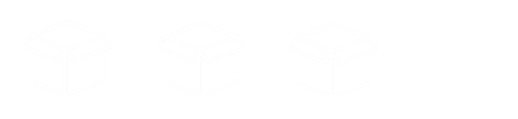

Wskaźniki:

-   są najważniejszym narzędziem w C/C++ (wiele popularnych języków nie
    dopuszcza bezpośredniego działania na wskaźnikach);

-   umożliwiają konstrukcje struktur danych;

-   pozwalają na tworzenie szybkiego i wydajnego kodu;

-   są niezbędne do dynamicznej alokacji pamięci.

O co w tym chodzi?

{width="0.9\\linewidth"}

    int A = 139;
    int *wsk = &A;

 \
Zmienna - pudełko z imieniem, do którego możemy włożyć jakąś wartość
(liczbę, napis, wartość logiczną).\
 \
Wskaźnik - zmienna, która trzyma informacje o tym gdzie w pamięci siedzi
inna zmienna.

Dlaczego wskaźnik musi mieć typ?\
Nie wszystkie pudełka mają taki sam rozmiar.\
Wskaźnik umożliwa nam skoczenie do pudełka za i przed, musi więc
wiedzieć jak daleko ma skoczyć.

         typ          ilość miejsca
  ------------------ ---------------
         char               1
        short               2
   int, long, float         4
        double              8

 \
 \
Jak to sprawdzić?

    printf("%d", sizeof(short));

Wskaźniki, a tablice

{width="0.9\\linewidth"}

    int *p;
    int a[3] = {2,0,5};
    p = &a[0];
    int* p2 = p + 1;

 \
Zmienne w tablicy przechowywane są obok siebie.\
Możemy przypisać wskaźnikowi adres dowolnej zmiennej w tablicy, a
następnie przesunąć się do innych elementów używając dodawania lub
odejmowania.\
Co się stanie jeśli w ten sposób wyjdziemy poza granice naszej tablicy?\

Odejmowanie wskaźników\
Różnica wskaźników to liczba półek jakie się znajdują między półkami, na
które wskazują.

    int a[] = {6, 2, 10};
    int *p0 = a;
    int *p1 = a+1;
    int *p2 = a+2;
    printf("p2-p0: %d\n",p2-p0); // p2-p0: 2
    printf("p2-p1: %d\n",p2-p1); // p2-p1: 1
    printf("p0-p1: %d\n",p0-p1); // p0-p1: -1

Cyz wskaźnik może nie wskazywać na nic?\
Może i często chcemy żeby tak było.

    int *p;
    p = NULL;

Przypisanie wartości NULL spowoduje, że wskaźnik nie będziena nic
wskazywał.\
Dwa pusta wskaźniki są zawsze równe, stąd przydatność do wyznaczania
granic różnych struktur.

{width="0.9\\linewidth"}

Operatory wskaźników\
Czyli znaczki, które cos zrobią gdy użyjemy je razem ze wskaźnikiem.\

   znaczek                 co to robi?                       przykład
  ---------- --------------------------------------- ------------------------
     $*$              deklaracja wskaźnika                  $int *p;$
     $*$      wyłuskanie wartości na którą wskazuje   $printf(" \% d", *p);$
     $+-$         inkrementacja \\dekremntacja             $p = p + 1;$
   $==, !=$        porównanie dwóch wskaźników           $if(p == NULL)$

Czego nie należy robić ze wskaźnikami?\

-   Wskaźniki nigdy nie powinny być używane przed inicjalizacją.\

-   Odwoływanie się do wskaźnika do którego nie przydzielono pamięci.\

-   Mylenie znaczków i zamienne stosowanie wskaźników i zmiennych na
    które wskazują.\

-   Wyjechanie wskaźnikiem za tablicę.
