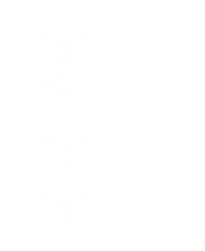
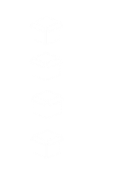
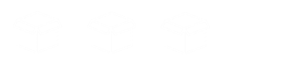

# Wskaźniki

Wskaźnik przechowuje adres obiektu lub funkcji. W C i C++ wskaźniki są podstawowym narzędziem do pracy z tablicami, dynamiczną pamięcią, strukturami danych i interfejsami systemowymi.

## Cele

Po tej prezentacji powinieneś umieć:

- zadeklarować i zainicjować wskaźnik,
- używać operatorów `&` i `*`,
- wyjaśnić arytmetykę wskaźników,
- odróżnić wskaźnik null, niezainicjowany i wiszący,
- poprawnie opisać relację między tablicą a wskaźnikiem.

## Adres i dereferencja

```c
#include <stdio.h>

int main(void) {
    int x = 10;
    int *ptr = &x;

    printf("x = %d\n", x);
    printf("&x = %p\n", (void *)&x);
    printf("ptr = %p\n", (void *)ptr);
    printf("*ptr = %d\n", *ptr);

    *ptr = 42;
    printf("x = %d\n", x);
}
```

- `&x` — adres obiektu `x`,
- `ptr` — adres zapisany we wskaźniku,
- `*ptr` — obiekt znajdujący się pod tym adresem.

## Co oznacza typ wskaźnika?

```c
int *pi;
double *pd;
char *pc;
```

Typ mówi kompilatorowi m.in.:

- jaki typ obiektu otrzymujemy po dereferencji,
- o ile elementów przesuwa się wskaźnik przy arytmetyce,
- jakie konwersje są dozwolone.

Nie należy zakładać, że `int` ma zawsze 4 bajty albo `double` zawsze 8. Sprawdzamy to przez `sizeof`:

```c
printf("%zu\n", sizeof(int));
```

## Obraz pamięci



Adres jest wartością reprezentującą położenie obiektu w przestrzeni adresowej procesu. Dokładna reprezentacja i rozmiar wskaźnika zależą od platformy.

## Tablica nie jest wskaźnikiem

To częste uproszczenie, które prowadzi do błędów.

```c
int a[4] = {10, 20, 30, 40};
```

`a` ma typ „tablica 4 elementów typu `int`”.

W **większości wyrażeń** nazwa tablicy ulega konwersji do wskaźnika na pierwszy element:

```c
int *p = a;       /* to samo co &a[0] */
printf("%d\n", *(p + 2));
```

Ale tablica i wskaźnik nie są tym samym typem. Widać to np. przy `sizeof`:

```c
printf("%zu\n", sizeof a);  /* rozmiar całej tablicy */
printf("%zu\n", sizeof p);  /* rozmiar wskaźnika */
```

## Arytmetyka wskaźników



Dla wskaźnika na element tablicy:

```c
int a[] = {6, 2, 10};
int *p = a;

printf("%d\n", *p);       /* 6 */
printf("%d\n", *(p + 1)); /* 2 */
printf("%d\n", *(p + 2)); /* 10 */
```

`p + 1` oznacza „następny element typu `int`”, a nie „następny bajt”.

## Odejmowanie wskaźników

Dwa wskaźniki można odejmować, jeżeli wskazują na elementy tej samej tablicy (lub pozycję jeden za końcem).

```c
#include <stddef.h>
#include <stdio.h>

int a[] = {6, 2, 10};
int *p0 = &a[0];
int *p2 = &a[2];

ptrdiff_t d = p2 - p0;
printf("%td\n", d);  /* 2 */
```

Wynik ma typ `ptrdiff_t`.

## Granice tablicy

Dozwolone jest utworzenie wskaźnika „jeden element za końcem”:

```c
int *end = a + 3;
```

Taki wskaźnik jest przydatny do porównań i iteracji, ale nie wolno go dereferencjować.

Wyjście poza dozwolony zakres arytmetyki wskaźników lub dereferencja poza tablicą prowadzi do niezdefiniowanego zachowania.

## Null, niezainicjowany i dangling pointer

To trzy różne sytuacje.

### Wskaźnik null

Jawnie nie wskazuje na obiekt:

```c
int *p = NULL;
```

W C++ preferujemy:

```cpp
int *p = nullptr;
```

### Wskaźnik niezainicjowany

```c
int *p;
```

Ma nieokreśloną wartość. Nie wolno go dereferencjować ani używać jako poprawnego adresu.

### Dangling pointer

Wskazywał na poprawny obiekt, ale jego czas życia już się skończył:

```c
int *p = malloc(sizeof *p);
free(p);

/* p nadal zawiera wartość adresu, ale obiekt już nie istnieje */
p = NULL;
```

Samo ustawienie `p = NULL` po `free()` nie naprawia innych kopii tego wskaźnika.

## Dereferencja null nie jest „gwarantowanym segmentation fault”

```c
int *p = NULL;
printf("%d\n", *p);
```

To **niezdefiniowane zachowanie**. System często zakończy program błędem ochrony pamięci, ale język nie gwarantuje konkretnego rodzaju awarii.

## Wskaźniki do struktur

```c
struct Point {
    int x;
    int y;
};

struct Point point = {1, 2};
struct Point *p = &point;

printf("%d\n", p->x);
```

`p->x` jest skrótem dla:

```c
(*p).x
```

## Lista jednokierunkowa



Wskaźniki pozwalają łączyć obiekty w struktury dynamiczne:

```c
struct Node {
    int value;
    struct Node *next;
};
```

Każdy węzeł przechowuje adres kolejnego elementu lub `NULL`.

## Dynamiczna pamięć w C

```c
#include <stdlib.h>

size_t n = 100;
int *data = malloc(n * sizeof *data);

if (data == NULL) {
    /* obsługa błędu */
}

/* ... */

free(data);
data = NULL;
```

Każda udana alokacja wymagająca ręcznego zarządzania musi mieć jasno określonego właściciela odpowiedzialnego za zwolnienie pamięci.

## Współczesny C++

W C++ surowe wskaźniki nadal są potrzebne, ale własność zasobów zwykle lepiej wyrażać przez:

- obiekty automatyczne,
- `std::vector`,
- `std::string`,
- `std::unique_ptr`,
- `std::shared_ptr` tylko wtedy, gdy rzeczywiście potrzebna jest współdzielona własność.

Surowy wskaźnik często dobrze komunikuje „obserwuję ten obiekt, ale go nie posiadam”.

## Najczęstsze pułapki

- Mylenie tablicy ze wskaźnikiem.
- Dereferencja `NULL` / `nullptr`.
- Użycie niezainicjowanego wskaźnika.
- Użycie pamięci po `free` / `delete`.
- Zwrócenie wskaźnika lub referencji do lokalnego obiektu.
- Arytmetyka poza granicami tablicy.
- Niezgodna para alokacji i zwalniania.

## Podsumowanie

Najważniejsze operatory:

| Operator | Znaczenie |
| --- | --- |
| `&x` | pobierz adres |
| `*p` | dereferencja |
| `p + n` | przesuń o `n` elementów |
| `p->field` | dostęp do pola obiektu przez wskaźnik |

Najważniejsza zasada: **wskaźnik jest użyteczny tylko wtedy, gdy wskazuje na obiekt, którego czas życia nadal trwa, i operujemy w dozwolonym zakresie pamięci.**
